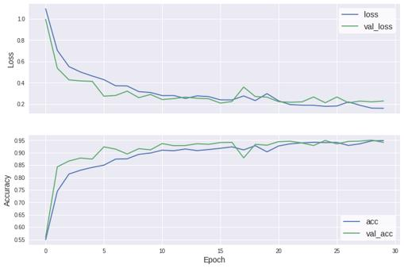

[](https://github.com/ambv/black)

# CNN Venice Boat Image Classifier

Convolutional Neural Networks trained to classify different types of boats.

## MarDCT data set

Maritime Detection, Classification, and Tracking ([MarDCT](http://www.dis.uniroma1.it/~labrococo/MAR/classification.htm)) is a database of videos and images containing data coming from multiple sources (fixed, moving, and Pan-Tilt-Zoom cameras) and from different scenarios. The classification data set contains 800x240 images and is organized in two different folders, one for the training phase and the other for testing the trained model.

<p align="center">
    
</p>

The training set contains 4774 images from 24 different categories of boats navigating in
the City of Venice. The jpeg files inside the folders are named according to the date, hour, and system track number. The folder "Water" contains false positives. The train folder is organized in the following way:

```
train/Alilaguna/20130304_060950_07485.jpg
train/Alilaguna/20130304_111941_04118.jpg
train/Alilaguna/20130304_114025_07564.jpg
.
.
.
train/Gondola/20130305_090134_40900.jpg
train/Gondola/20130305_090138_41092.jpg
train/Gondola/20130305_092253_44472.jpg
```

where `Alilaguna`, `Gondola`, etc. are class labels. The test set contains 1969 images with ground-truth annotations in the format `<image-name>;<category>`, for example

```
20130412_044827_56976.jpg;Vaporetto ACTV
```

## Model implementation

The Convolutional Neural Network is implemented in Python with Keras 2.1.6 and TensorFlow 1.12 as backend. The architecture of the CNN is inspired by the VGGNet [5], with less parameters. The network is composed by 13 layers:

- Two Convolution layers with 32 filters of size 3x3, stride 1 and padding same followed by ReLU layer, Maxpool layer with size and stride set to 2 and a Droput layer
- Two Convolution layers with 64 filters of size 3x3, stride 1 and padding same followed by ReLU layer, Maxpool layer with size and stride set to 2 and a Droput layer
- Three Convolution layers with 64 filters of size 3x3, stride 1 and padding same followed by ReLU layer, Maxpool layer with size and stride set to 2 and a Droput layer
- Three Convolution layers with 128 filters of size 3x3, stride 1 and padding same followed by ReLU layer, Maxpool layer with size and stride set to 2 and a Droput layer
- Fully Connected Layer with 2048 output neurons followed by ReLU layer
- Fully Connected Layer with 1000 output neurons followed by ReLU layer
- Fully Connected Layer with the number of classes as output neurons followed by Softmax layer

Tensorflow’s implementation of Keras high-level API is used to build the network. The
most common way to define a model is by building a graph of layers using the Sequential API:

```python
model = Sequential()
# INPUT -> [CONV -> RELU]*2 -> POOL
model.add(Conv2D(32, (3, 3), input_shape=IMAGE_DIMS, padding='same', activation='relu'))
model.add(Conv2D(32, (3, 3), activation='relu', padding='same'))
model.add(MaxPooling2D(pool_size=(2, 2), strides=(2, 2)))
model.add(Dropout(0.5))
# [CONV -> RELU]*2 -> POOL
model.add(Conv2D(64, (3, 3), activation='relu', padding='same'))
model.add(Conv2D(64, (3, 3), activation='relu', padding='same',))
model.add(MaxPooling2D(pool_size=(2, 2), strides=(2, 2)))
model.add(Dropout(0.5))
# [CONV -> RELU]*3 -> POOL
model.add(Conv2D(64, (3, 3), activation='relu', padding='same',))
model.add(Conv2D(64, (3, 3), activation='relu', padding='same',))
model.add(Conv2D(64, (3, 3), activation='relu', padding='same',))
model.add(MaxPooling2D(pool_size=(2, 2), strides=(2, 2)))
model.add(Dropout(0.5))
# [CONV -> RELU]*3 -> POOL
model.add(Conv2D(128, (3, 3), activation='relu', padding='same',))
model.add(Conv2D(128, (3, 3), activation='relu', padding='same',))
model.add(Conv2D(128, (3, 3), activation='relu', padding='same',))
model.add(MaxPooling2D(pool_size=(2, 2), strides=(2, 2)))
model.add(Dropout(0.5))
# [FC -> RELU]*2 -> FC
model.add(Flatten())
model.add(Dense(2048, activation='relu'))
model.add(Dropout(0.5))
model.add(Dense(1000, activation='relu'))
model.add(Dropout(0.5))
model.add(Dense(N_CLASSES, activation='softmax'))
```

## Data set preparation

The dataset is divided into two folders, one contains the training set and the other the test set. However, they have a different organization. Training files are inside their class folder, while test files are labelled in a text file.
First thing is to clean the ground truth text file to normalize the class labels. Then, we organize the test folder in order to make it uniform to the training one. Both data set are now organized in the following way:

```
train/Alilaguna/20130304_060950_07485.jpg
train/Alilaguna/20130304_111941_04118.jpg
train/Alilaguna/20130304_114025_07564.jpg
.
.
.
train/Gondola/20130305_090134_40900.jpg
train/Gondola/20130305_090138_41092.jpg
train/Gondola/20130305_092253_44472.jpg
```

The `read_images()` function is used to load images with their corresponding label and resizes it to 128x128 pixels. Images are stored in a numpy array, each pixel is in a range `[0,255]`, so we normalize thepixel range to `[0,1]` to make the convergence rate faster. Each label is converted from string to a one hot encoding array indicating the presence of a class label.

There are two different scenarios:

- **Classification of 5 general classes.** Labels of the data set must be adapted to this scenario to classify 5 general classes. While reading (in `read_images()` function), it modifies the label of each image according to the following rules.

  ```python
  def general_classes(label):
      switch = {
          'Alilaguna': people_transport,
          'Lanciafino10m': people_transport,
          'Lanciafino10mBianca': people_transport,
          'Lanciafino10mMarrone': people_transport,
          'Lanciamaggioredi10mBianca': people_transport,
          'Lanciamaggioredi10mMarrone': people_transport,
          'MotoscafoACTV': people_transport,
          'VaporettoACTV': people_transport,
          'Motobarca': general_transport,
          'Mototopo': general_transport,
          'Motopontonerettangolare': general_transport,
          'Raccoltarifiuti': general_transport,
          'Barchino': pleasure_craft,
          'Cacciapesca': pleasure_craft,
          'Patanella': pleasure_craft,
          'Sanpierota': pleasure_craft,
          'Topa': pleasure_craft,
          'Gondola': rowing_transport,
          'Caorlina': rowing_transport,
          'Sandoloaremi': rowing_transport,
          'Polizia': public_utility,
          'Ambulanza': public_utility,
          'VigilidelFuoco': public_utility,
          'Water': water
      }
      return switch[label]()
  ```

- **Classification of a specific number of classes.** The test set doesn’t contain all the 24 classes in the training set. In this scenario, we will try to classify the classes that the two data sets have in common. These classes are the following:

  ```python
  classes = {'Alilaguna',
          'Lanciafino10m',
          'Lanciafino10mBianca',
          'Lanciafino10mMarrone',
          'Lanciamaggioredi10mBianca',
          'MotoscafoACTV',
          'VaporettoACTV',
          'Motobarca',
          'Mototopo',
          'Motopontonerettangolare',
          'Raccoltarifiuti',
          'Barchino',
          'Patanella',
          'Topa',
          'Gondola',
          'Sandoloaremi',
          'Polizia',
          'Ambulanza',
          'Water'
  }
  ```

## Results

### Classification of 5 general classes

The model has trained on a GPU for 30 epochs. The run is done with dropuot rate at 0.5 between both convolutional layer and the fully connected layers, with accuracy for training set of 0.95 and 0.94 for the test set.

```
Epoch 1/30
149/149 [==============================] - 21s 139ms/step - loss: 1.0923 - acc: 0.5491 - val_loss: 0.9938 - val_acc: 0.5595
Epoch 2/30
149/149 [==============================] - 17s 115ms/step - loss: 0.7014 - acc: 0.7449 - val_loss: 0.5361 - val_acc: 0.8431
.
.
.
Epoch 29/30
149/149 [==============================] - 17s 115ms/step - loss: 0.1612 - acc: 0.9482 - val_loss: 0.2206 - val_acc: 0.9507
Epoch 30/30
149/149 [==============================] - 17s 116ms/step - loss: 0.1608 - acc: 0.9483 - val_loss: 0.2280 - val_acc: 0.9417
Training Time: 00:08:41.77
```

<p align="center">
    
</p>

In the following report, there are precision, recall and f1-score for each class, and different averages values. The model performs well for classes that have a good number of images, like General Trasport and People Trasport boats, but it has lower scores for classes with fewer images, for example, Rowing boats.

```
                   precision    recall  f1-score   support

General Transport       0.95      0.95      0.95       365
 People Transport       0.98      0.95      0.96       700
   Pleasure Craft       0.74      0.91      0.82       154
   Public Utility       0.67      0.65      0.66        37
 Rowing Transport       0.67      0.33      0.44         6
            Water       0.99      0.98      0.98       420

        micro avg       0.94      0.94      0.94      1682
        macro avg       0.83      0.79      0.80      1682
     weighted avg       0.95      0.94      0.94      1682
```

Using the bottleneck features of a pre-trained network can increase the performance of the model in a few minutes of training time. Keras offers deep learning models that are made available alongside pre-trained weights. We will use the VGG16 model, with weights pre-trained on the ImageNet dataset.

```python
from keras.applications import VGG16

vgg_conv = VGG16(weights='imagenet', include_top=False, input_shape=(128, 128, 3))
```

The model now takes 1 minute to train, with a validation accuracy of 92%

```
Epoch 1/30
4774/4774 [==============================] - 15s 3ms/step - loss: 3.8053 - acc: 0.6600 - val_loss: 0.4073 - val_acc: 0.8835
Epoch 2/30
4774/4774 [==============================] - 2s 467us/step - loss: 0.3630 - acc: 0.8729 - val_loss: 0.2717 - val_acc: 0.9150
.
.
.
Epoch 29/30
4774/4774 [==============================] - 2s 468us/step - loss: 8.3819e-05 - acc: 1.0000 - val_loss: 0.5423 - val_acc: 0.9180
Epoch 30/30
4774/4774 [==============================] - 2s 467us/step - loss: 7.2445e-05 - acc: 1.0000 - val_loss: 0.5500 - val_acc: 0.9180
Training Time: 00:01:20.02
```

### Classification of a specific number of classes

Since the test set doesn’t contain all the 24 classes in the training set, we can train the model to classify only the classes the test set and training set have in common. The values of the batch size and the number of epochs remain equal to those in the general classes scenario. The model has trained again on a GPU for 30 epochs, with dropout rate equal to 0.5 and accuracy for training set of 0.90 and 0.87 for the test set.

```
Epoch 1/30
147/147 [==============================] - 20s 139ms/step - loss: 2.2034 - acc: 0.2645 - val_loss: 1.3536 - val_acc: 0.6190
Epoch 2/30
147/147 [==============================] - 17s 115ms/step - loss: 1.3741 - acc: 0.5837 - val_loss: 1.1179 - val_acc: 0.6112
.
.
.
Epoch 29/30
147/147 [==============================] - 17s 116ms/step - loss: 0.3154 - acc: 0.9006 - val_loss: 0.4983 - val_acc: 0.8624
Epoch 30/30
147/147 [==============================] - 17s 116ms/step - loss: 0.3277 - acc: 0.8946 - val_loss: 0.4710 - val_acc: 0.8672
Training Time: 00:08:35.09
```

Scores are generally good but for some classes, the model isn’t able to classify correctly
any image. For example `Sandoloaremi` images are classified as `Gondola` or `Patanella`. Probably, it’s due to the small dimension of the dataset.

```
                           precision    recall  f1-score   support

                Alilaguna       1.00      0.84      0.91        19
                Ambulanza       0.83      0.91      0.87        22
                 Barchino       0.53      0.39      0.45        51
                  Gondola       0.50      0.33      0.40         3
            Lanciafino10m       0.00      0.00      0.00         7
      Lanciafino10mBianca       0.91      0.85      0.88       217
     Lanciafino10mMarrone       0.93      0.89      0.91       125
Lanciamaggioredi10mBianca       0.00      0.00      0.00         6
                Motobarca       0.62      0.25      0.36        59
  Motopontonerettangolare       0.75      1.00      0.86         3
            MotoscafoACTV       1.00      1.00      1.00         1
                 Mototopo       0.89      0.95      0.92       284
                Patanella       0.47      0.81      0.60        74
                  Polizia       0.33      0.40      0.36        15
          Raccoltarifiuti       0.41      0.74      0.53        19
             Sandoloaremi       0.00      0.00      0.00         3
                     Topa       0.29      0.07      0.11        29
            VaporettoACTV       0.98      1.00      0.99       325
                    Water       0.97      0.98      0.98       420

                micro avg       0.87      0.87      0.87      1682
                macro avg       0.60      0.60      0.59      1682
             weighted avg       0.87      0.87      0.86      1682
```

With a pre-trained network, we can again reduce the required time to train the model. We will use the same VGG16 model as before. The model needs only 1 minute to reach the same validation accuracy of the previous model, which was trained from scratch.

```
Epoch 1/30
4717/4717 [==============================] - 3s 643us/step - loss: 0.9184 - acc: 0.7433 - val_loss: 0.6835 - val_acc: 0.7931
Epoch 2/30
4717/4717 [==============================] - 2s 466us/step - loss: 0.4880 - acc: 0.8539 - val_loss: 0.5616 - val_acc: 0.8466
.
.
.
Epoch 29/30
4717/4717 [==============================] - 2s 464us/step - loss: 6.0603e-04 - acc: 1.0000 - val_loss: 0.7323 - val_acc: 0.8763
Epoch 30/30
4717/4717 [==============================] - 2s 466us/step - loss: 5.4771e-04 - acc: 1.0000 - val_loss: 0.7565 - val_acc: 0.8751
Training Time: 00:01:07.40
```

The classification report shows better results compared to the manually trained model.

```
                           precision    recall  f1-score   support

                Alilaguna       1.00      0.95      0.97        19
                Ambulanza       0.81      0.59      0.68        22
                 Barchino       0.63      0.24      0.34        51
                  Gondola       1.00      0.67      0.80         3
            Lanciafino10m       0.00      0.00      0.00         7
      Lanciafino10mBianca       0.85      0.89      0.87       217
     Lanciafino10mMarrone       0.91      0.82      0.87       125
Lanciamaggioredi10mBianca       0.00      0.00      0.00         6
                Motobarca       0.62      0.51      0.56        59
  Motopontonerettangolare       1.00      1.00      1.00         3
            MotoscafoACTV       1.00      1.00      1.00         1
                 Mototopo       0.90      0.93      0.92       284
                Patanella       0.50      0.82      0.63        74
                  Polizia       0.25      0.27      0.26        15
          Raccoltarifiuti       0.76      0.84      0.80        19
             Sandoloaremi       0.67      0.67      0.67         3
                     Topa       0.53      0.31      0.39        29
            VaporettoACTV       1.00      1.00      1.00       325
                    Water       0.96      0.99      0.97       420

                micro avg       0.88      0.88      0.88      1682
                macro avg       0.71      0.66      0.67      1682
             weighted avg       0.87      0.88      0.87      1682
```

## Further improvements

There are of course areas of improvements. The images are preprocessed and rescaled to a smaller size (128x128) to be fitted in the memory. With the new tensorflow's Dataset API, the images can be loaded into the memory and preprocessed in batches. This allows increasing the image size to prevent losing too much information.
